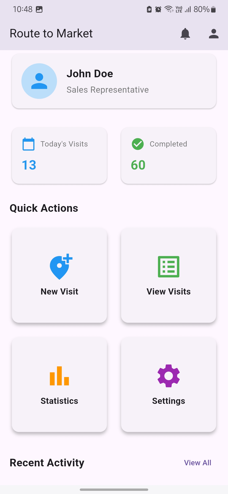
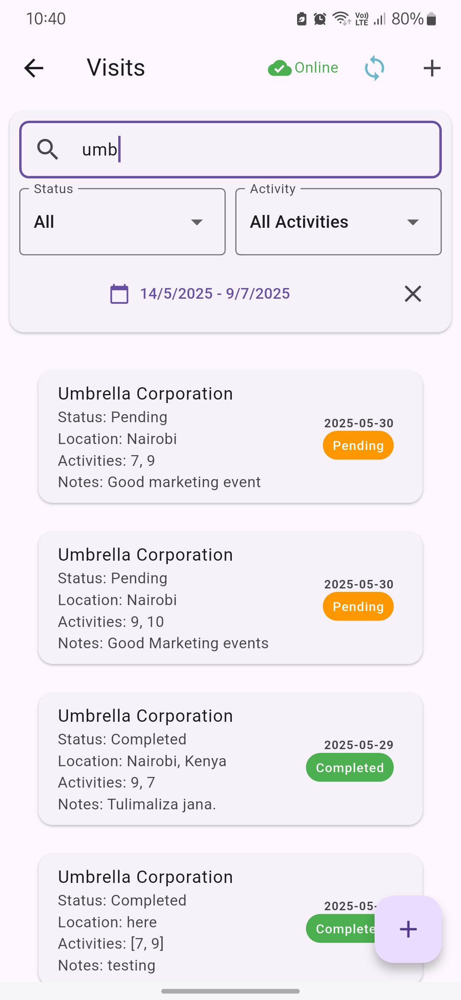
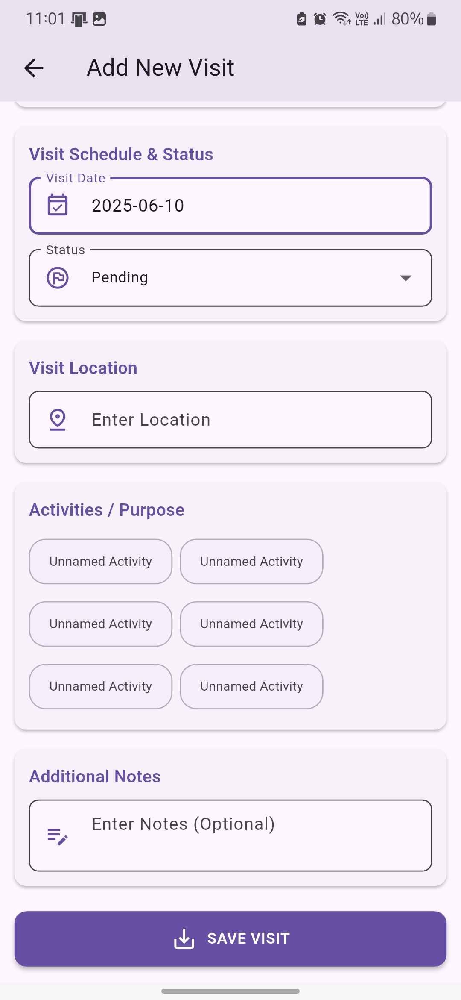
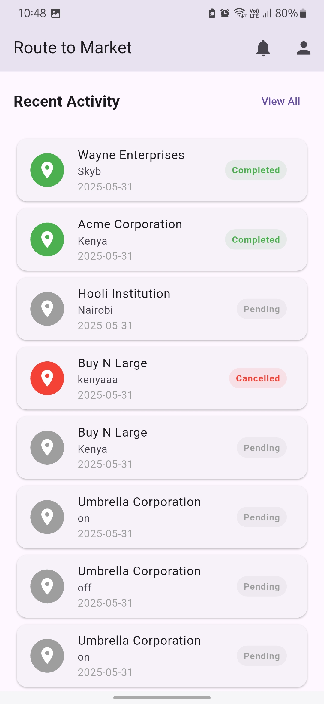
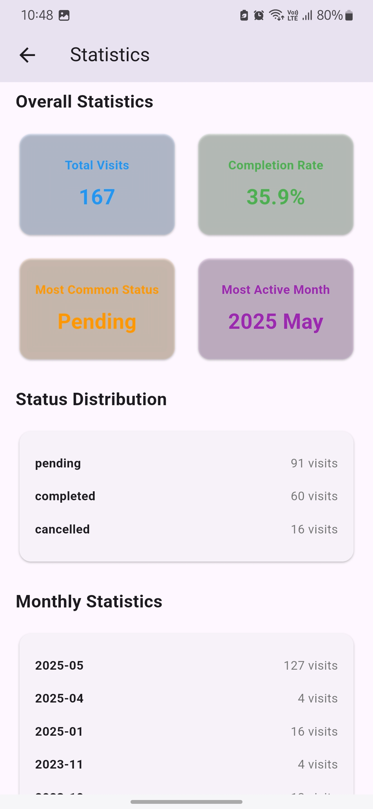
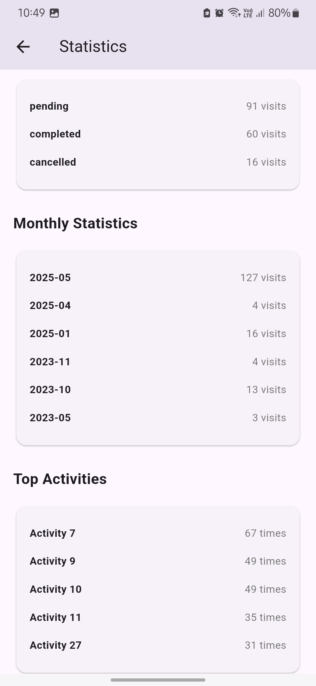

# Route-to-Market (RTM) Sales Force Automation App

A Flutter application for tracking sales visits and activities, built with offline support and modern architecture.

## ✨Overview

This application allows sales representatives to:
- Track customer visits
- Record activities completed during visits
- View visit statistics
- Search and filter visits
- Work offline with automatic sync when online


## 📱 App Screenshots

*(Illustrate the core functionalities and user interface of your app. Replace these placeholders with your actual screenshots.)*

<p align="center">
  
  
  
  
  
  
</p>

---


## 🏗️ Architecture

The application follows a clean architecture pattern with the following layers:

### Presentation Layer
- **Views**: UI components and screens
- **Controllers**: State management using GetX
- **Widgets**: Reusable UI components

### Domain Layer
- **Models**: Data models for visits, customers, and activities
- **Services**: Business logic and data operations

### Data Layer
- **API Services**: Communication with Supabase backend
- **Offline Storage**: Local data persistence using SharedPreferences
- **Sync Service**: Handles data synchronization between local and remote

## ✨ Key Features

1. **Visit Management**
   - Create new visits
   - View visit history
   - Track visit status
   - Add visit notes and location

2. **Activity Tracking**
   - Record activities during visits
   - View activity history
   - Track completion status

3. **Offline Support**
   - Create visits offline
   - Automatic sync when online
   - Conflict resolution
   - Network status monitoring

4. **Search and Filtering**
   - Search by customer name
   - Filter by date range
   - Filter by status
   - Filter by activities

## 🛠️ Setup Instructions

1. **Prerequisites**
   ```bash
   Flutter SDK (latest stable version)
   Dart SDK (latest stable version)
   ```

2. **Installation**
   ```bash
   # Clone the repository
   git clone [https://github.com/yourusername/rtm_app.git](https://github.com/yourusername/rtm_app.git)

   # Navigate to project directory
   cd rtm_app

   # Get dependencies
   flutter pub get
   ```

3. **Configuration**
   - The app uses Supabase for backend services
   - API key is already configured in the services
   - Ensure your `.env` file is set up if used for Supabase credentials (not explicitly shown in pubspec but good practice).

4. **Running the App**
   ```bash
   # Run in debug mode
   flutter run

   # Build for production
   flutter build apk --release
   ```

## ✈️ Offline Support Details

The app implements offline-first architecture:
- Visits can be created without internet connection
- Data is stored locally using SharedPreferences
- Automatic sync when connection is restored
- Conflict resolution based on timestamps

## 🧪 Testing

The project includes:
- Unit tests for business logic
- Widget tests for UI components
- Integration tests for critical flows

Run tests using:
```bash
flutter test
```

## API Documentation

### Endpoints

1. **Visits**
   - GET `/visits` - List all visits
   - POST `/visits` - Create new visit
   - PATCH `/visits/:id` - Update visit
   - DELETE `/visits/:id` - Delete visit

2. **Customers**
   - GET `/customers` - List all customers
   - POST `/customers` - Create new customer

3. **Activities**
   - GET `/activities` - List all activities
   - POST `/activities` - Create new activity

### Authentication
All requests require an API key in the header:
```
apikey: your-api-key
```
(Assuming this is how Supabase is configured, or adjust as per your Supabase setup, e.g., Bearer token for JWT)

## Assumptions and Limitations

1. **Assumptions**
   - Stable internet connection for initial data sync
   - Sufficient local storage for offline data
   - Single user per device

2. **Limitations**
   - No real-time updates
   - Limited offline storage capacity
   - Basic conflict resolution

## Future Improvements

1. **Planned Features**
   - Real-time updates
   - Advanced conflict resolution
   - Data compression for offline storage
   - Multi-user support

2. **Technical Improvements**
   - Implement caching strategy
   - Add background sync
   - Enhance error handling
   - Improve performance

## Contributing

1. Fork the repository
2. Create a feature branch
3. Commit your changes
4. Push to the branch
5. Create a Pull Request
